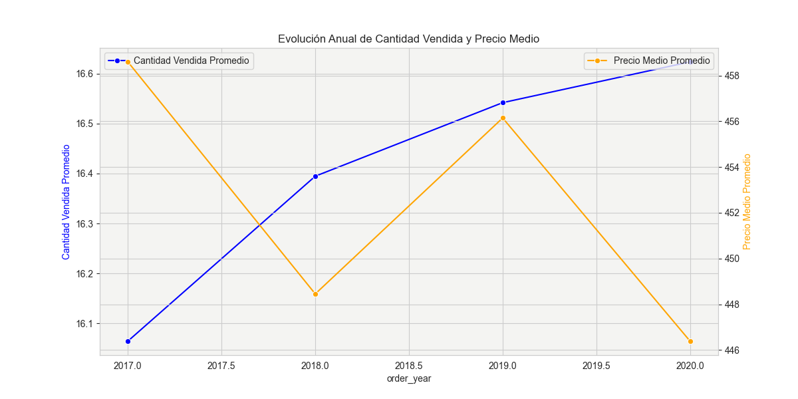

# Proyecto_Final_EDA_Dashboard

**The Power - Proyecto 5**

## 🎯 Objetivo del proyecto

Este proyecto utiliza datos de la plataforma de servicios de comida a domicilio “Zomato”, que opera en India.

Los objetivos principales son:
- Realizar una limpieza exhaustiva de los datos provenientes de distintos sistemas del negocio.
- Comprender el rendimiento de cada restaurante, tipo de comida y ciudad.
- Identificar patrones de consumo, ingresos y satisfacción del cliente.
- Construir un dashboard interactivo en Power BI para facilitar la toma de decisiones.
- Documentar el proceso completo en GitHub para fines de corrección de este caso de estudio en el marco de aprendizaje con el centro de formación ThePower.

## 📁 Estructura del repositorio

Ruta: https://github.com/Sebastien732/Proyecto_final_EDA_dashboard.git

- `datos/`: Contiene los conjuntos de datos originales (`xlsx`) y los datos transformados.
- `notebooks/`: Notebooks de Jupyter con el desarrollo del análisis y gráficos ilustrativos para el README.
- `scripts/`: Código auxiliar para limpieza y transformación.
- `README.md`: Documento explicativo del proyecto y hallazgos.

```
📁 Proyecto_EDA_Python
├─ README.md # Documentación del proyecto
├──📁 Dashboards/ # Archivos de Power BI
│   └─ nombre_dashboard.bi?
├─ 📁 Datos/ # Datasets originales y procesados
│   ├─ final.csv
│   ├─ food.xlsx
│   ├─ menu.xlsx
│   ├─ orders.xlsx
│   ├─ restaurant.xlsx
│   └─ users.xlsx
├─ 📁 Notebooks/ # Análisis exploratorio y limpieza
│   └─ exploracion.ipynb
├─ 📁 Outputs/ # Visualizaciones y tablas finales
└─ 📁 Scripts/ # Scripts de transformación
    └─ limpieza_transformacion.py

```

## 🛠️ Herramientas utilizadas

- Python
- Pandas
- Numpy
- Matplotlib
- Seaborn
- Jupyter Notebook
- Visual Studio Code
- Power BI

## 🗂️ Fuente de datos

- `orders.xlsx`: Detalles sobre los pedidos.
- `food.xlsx`: Información sobre los platos de comida.
- `menu.xlsx`: Información sobre los tipos de cocina y precios.
- `restaurant.xlsx`: Información sobre los restaurantes.
- `users.xlsx`: Información sobre los clientes.
- `df_final`: DataFrame final obtenido tras la combinación, limpieza y transformación individual de los conjuntos de datos anteriores.

## ✅ Pasos realizados

## 📦 Datasets utilizados

### Dataset 1: Food

- `f_id`: Identificador del plato.
- `item`: Nombre del plato.
- `veg_or_non_veg`: Tipo de comida (vegetariana o no vegetariana).

### Dataset 2: Menu

- `menu_id`: Identificador del menú.
- `r_id`: Identificador del restaurante.
- `f_id`: Identificador del plato.
- `cuisine`: Tipo de comida.
- `price`: Precio del menú.

### Dataset 3: Pedidos

- `order_date`: Fecha del pedido.
- `sales_qty`: Cantidad vendida.
- `sales_amount`: Importe del pedido.
- `currency`: Divisa.
- `user_id`: Identificador del cliente.
- `r_id`: Identificador del restaurante.

### Dataset 4: Restaurant

- `id`: Identificador del restaurante.
- `name`: Nombre del restaurante.
- `Country`: País donde se encuentra el restaurante.
- `city`: Ciudad del restaurnte. 
- `rating`: Calificación general del restaurante.
- `rating_count`: Rango de cantidad de calificaciones recibidas por el restaurante.
- `cuisine`: Tipo de comida.
- `link`: Enlace web de la página del restaurante.
- `address`: Dirección del restaurante.

### Dataset 5: Users

- `user_id`: Identificador del cliente.
- `name`: Nombre del cliente.
- `age`: Edad del cliente.
- `Gender`: Género del cliente.
- `Marital Status`: Estado civil del cliente.
- `Occupation`: Situación laboral del cliente.

## 🔍 Etapas del análisis

### 1. **Carga, revisión y análisis inicial por dataset**

- **`df_food`**: Tiene 371,560 entradas y 3 columnas.
  - Cada columna contiene 8 valores nulos; los datos son de tipo ‘object’.
  - Al visualizar los valores nulos en la tabla, observamos que corresponden a filas completamente vacías, por lo que se eliminarán durante la fase de limpieza.
  - En la columna ‘veg_or_non_veg’ se observan únicamente dos tipos de valores.
  - En la columna ‘item’ hay menos valores que en ‘f_id’, lo que sugiere que varias referencias tienen el mismo nombre de plato. Más adelante, tras combinar todos los datos, se evaluará si es necesario unificar estos platos bajo una única referencia.

- **`df_menu`**: Tiene 1,048,575 entradas y 5 columnas.
  - Uno de los menús contiene un valor nulo en la columna price; los datos son de tipo ‘object’, ‘int64’ y ‘float64’ y parecen coherentes con la información observada.
  - Se revisará el artículo sin precio una vez que todos los datos estén combinados para evaluar su impacto y tomar la medida de limpieza adecuada.
  - Los valores únicos por columna están distribuidos de la siguiente manera:
    - menu_id: 918,168
    - r_id: 12,117
    - f_id: 282,381
    - cuisine: 1,436
    - price: 3,308
  - Al comparar la cantidad de identificadores únicos con el número total de entradas, se deduce que el mismo menu_id puede encontrarse en varios restaurantes (por ejemplo, en una misma cadena).
  - Tras investigar posibles valores atípicos en la columna price, se identifican outliers en comparación con la moda y la mediana. Podrían corresponder a menús de restaurantes de lujo, pero aún no se sabe si hubo pedidos de estos menús, por lo que se revisará tras la combinación y limpieza inicial de los datasets.

- **`df_order`**: Tiene 150,281 entradas y 6 columnas.
  - La columna ‘r_id’ contiene 1,617 valores nulos; los datos son de tipo ‘datetime64’, ‘object’, ‘int64’ y ‘float64’ y parecen coherentes con la información observada, salvo ‘r_id’, que debería ser de tipo ‘int64’ en vez de ‘float64’.
  - Esta tabla representa la relación de las órdenes con el cliente y el restaurante proveedor; si no se dispone del identificador del restaurante, no se podrá extraer información concluyente, por lo que estas filas se eliminarán durante la limpieza.
  - Los valores únicos por columna están distribuidos de la siguiente manera:
    - order_date: 806
    - sales_qty: 566
    - sales_amount: 7,983
    - currency: 1
    - user_id: 77,929
    - r_id: 148,541
  - En la columna ‘currency’ solo hay un valor (INR), lo que se tendrá en cuenta durante la limpieza.
  - En la columna sales_qty se observan valores atípicos. La media y la moda indican una venta por usuario, pero hay pedidos con cantidades elevadas que podrían corresponder a eventos (bodas, celebraciones, banquetes, etc.).
  - Se supone que el importe de ventas es proporcional a la cantidad vendida. Para comprobarlo, se genera un gráfico de correlación entre ambos parámetros y, en vez de una correlación proporcional, se observan dos tendencias: una indica un vínculo claro entre ingresos y cantidad vendida, la otra muestra un aumento de ingresos con menor cantidad vendida, posiblemente por el valor del menú según el restaurante.
  - Se detecta importe de ventas a 0, eliminaremos estas filas en la fase de limpieza.
  - Se puede aprovechar la fecha de pedido creando columnas adicionales para agrupar por día de la semana, mes y año, y así estudiar tendencias y evoluciones.
  - El intervalo de datos se extiende del 04/10/2017 al 26/06/2020. 


- **`df_restaurant`**: Tiene 148,540 entradas y 9 columnas.
  - Hay valores nulos en varias columnas de distinta importancia: ‘name’, ‘rating’, ‘rating_count’, ‘cuisine’ y ‘address’. Al revisar una muestra de las filas sin nombre de restaurante, se observa que también faltan otros datos clave, por lo que estas filas se eliminarán, considerando que representan menos del 0.06% por columna.
  - Todos los datos aparecen como ‘object’; más adelante se transformará el tipo de datos de ‘rating’ a float64 para mayor coherencia analítica. En la muestra de la columna rating aparece el valor ‘—’, que deberá ser reemplazado por ‘NaN’ para cálculos posteriores como medias.
  - La columna ‘cuisine’ ya existe en el dataset ‘df_menu’.
  - Se cambiarán los nombres de las columnas para mejor identificación y se verificará si los valores coinciden una vez combinados, o si pueden usarse para rellenar valores faltantes. Esto también podría indicar que un mismo restaurante ofrece varios tipos de comida.
  - El identificador único de restaurante tiene un nombre diferente en este dataset (`id`) y en `df_order` (`r_id`); será necesario unificarlo para combinar los datos.
  - Los valores únicos por columna están distribuidos de la siguiente manera:
    - id: 148,540
    - name: 112,817
    - Country: 1
    - city: 821
    - rating: 42
    - rating_count: 8
    - cuisine: 2,132
    - link: 148,540
    - address: 148,400
  - Como en el dataset anterior, la columna Country (India) tiene un único valor, lo que se tendrá en cuenta en la limpieza.
  - El formato de la dirección del restaurante es inconsistente (a veces incluye país, a veces no; el código postal no siempre está presente o tiene formato erróneo). Si fuera posible, se podría haber realizado un estudio por estado donde se encuentran los restaurantes.
  - La página web del restaurante y su dirección completa no aportan valor al estudio, por lo que se eliminarán las columnas ‘link’ y ‘address’ durante la limpieza.
  - Se identifico duplicados de direccion, la direccion completa consta con el nombre del restaurante por lo cual procederemos a la limpieza de los duplicados mas adelante
  - La columna cuisine tiene 2132 valores unicos y son combinaciones de varios tipos de cocina por lo cual tendremos que racionalizar y simplificar la lista para un estudio coherente de este parametro. Se identifica un maximo de 2 tipos de cocina en la misma columna y un total de 126 tipos unicos. 

- **`df_users`**: Tiene 100,000 entradas y 6 columnas.
  - No hay valores nulos; los tipos de datos son coherentes con la información mostrada en las muestras.
  - Los valores únicos por columna están distribuidos de la siguiente manera:
    - user_id: 100,000
    - name: 71,251
    - Age: 16
    - Gender: 2
    - Marital Status: 3
    - Occupation: 4
  - La cantidad total de usuarios es menor que el número de usuarios en ‘df_orders’. Se supone que no todos los clientes son activos o tienen un pedido registrado.
  - Hay menos valores únicos en la columna ‘name’ que en ‘user_id’, lo que puede explicarse por la presencia de homónimos. En la limpieza se comprobará que los perfiles sean diferentes, ya que también podría tratarse de usuarios duplicados con más de un identificador.
  - El campo “name” existe tanto en la tabla de restaurante como en la de usuario; se renombrarán de forma más específica en la limpieza.
  - El rango de edad en el campo “Age” está comprendido entre 18 y 33 años, y no se observan anomalías en los datos.
---

### **Conclusión de la revisión inicial**

Tras esta primera evaluación, se observa que la tabla de pedidos no indica el contenido de cada pedido, ya que ni el menú ni el ítem solicitado están especificados.

Por otra parte, la tabla de menú contiene una lista de 12,117 identificadores de restaurante, mientras que la tabla de restaurantes tiene 148,540 identificadores únicos. Por ello, no será posible utilizar la tabla de menú para un análisis en profundidad.

El estudio se basará únicamente en los dataframes orders, restaurant y users.

---


### 2. **Limpieza de datos**

**🧹 Limpieza por dataset**

#### df_restaurant
- Eliminación de las filas sin nombre de restaurante.
- Eliminación de las columnas ‘Country’, y ‘link’.
- Cambio del nombre del identificador único de restaurante de ‘id’ a ‘r_id’.
- Reemplazo del valor ‘—’ de la columna ‘rating’ por Null.
- Cambio del tipo de dato de la columna ‘rating’ de object a float.
- Cambio de nombre de la columna ‘name’ a ‘r_name’ en `df_restaurant`.
- Eliminacion de los filas con direccion duplicada (incluyendo nombre del restaurante) guardando el primer r_id
- Eliminación de las columnas ‘Country’, ‘link’ y ‘address’.
- Desde la columna cocina creamos 2 columns 'cuisine_1' and 'cuisine_2
- Eliminación la columna cocina
- Eliminación de las filas con valores nulos en ‘cuisine_1’ 
- Creamos una nueva columna 'cuisine_category' para categorizar los valores de las 2 columnas anteriores de la forma siguiente:  

_**Italian:**_ italian, pizza, pasta, mediterranean, pastas, pizzas  
_**Asian:**_ chinese, dim sum, szechuan, asian, tibetan, thai, oriental, burmese, korean, malaysian, singaporean, vietnamese, noodles, nepalese, pan-asian  
_**Indian:**_ indian, curry, tandoori, punjabi, bengali, gujarati, rajasthani, maharashtrian, kerala, chettinad, mughlai, hyderabadi, biryani, tandoor, thali, chaat, north indian, south indian, thalis, North Indian, naga, bihari, north eastern, andhra, parsi, goan, haleem, assamese, mangalorean, malwani  
_**Mexican:**_ mexican, tacos, burritos  
_**Fast Food:**_ fast food, burgers, fries, snacks, snack, street food, combo  
_**Japanese:**_ japanese, sushi, ramen  
_**Fish and Seafood:**_ seafood, fish, coastal  
_**Vegetarian:**_ vegetarian, vegan  
_**Desserts:**_ desserts, ice cream, bakery, sweets, paan, bakery products, waffles, waffle, ice cream cakes  
_**Beverage:**_ cafe, coffee, tea, juice, beverages, juices  
_**American:**_ american, steakhouse, bbq, grill, barbecue, italian-american  
_**European:**_ french, bistro, crepes, european, continental, continental food  
_**Middle Eastern:**_ middle eastern, lebanese, persian, arabian, shawarma, kebab, afghani, turkish, kebabs  
_**Healthy:**_ healthy, salads, organic, gluten free, salad, healthy food  

- Tras estudiar la cantidad de restaurantes y sus nombres observamos valors compuestos con nombre del restaurante o barrio de la ciudad. Se guarda unicamente la ultima parte de los nombres con varios valores (separados por espacio o coma) para asegurarse guardar solo la ciudad. Con este metodo, pasamos de 821 valores unicos a 552

#### df_orders
- Eliminación de las filas con valores nulos en ‘r_id’.
- Cambio del tipo de dato de ‘r_id’ de float a int.
- Eliminación de la columna ‘currency’.
- Creación de las columnas ‘order_day’, ‘order_month’, ‘order_year’ y day type a partir de la fecha completa (los fines de semana incluyen solo sabado y domingo). 
- Eliminación de las filas con valor 0 en ‘sales_amount’ en `df_orders`.
- Creación de la columna ‘average_sales_price’ con el valor de ‘sales_amount’ dividido por la cantidad vendida en ‘sales_qty’.
- Creacion de un identificador unico de pedido 'order_id'

#### df_users
- Cambio de nombre de la columna ‘name’ a ‘u_name’ en `df_users`.

---

### 3. **Unificación de datasets**
- Combinación de los datasets usando claves comunes (`user_id` y `r_id`).
- Limpieza adicional de las filas obtenidas con campos vacíos (`r_name` y `cuisine`).
- Reorganización del orden de las columnas para mejorar la legibilidad.
- Verificación de consistencia y duplicados tras la fusión.
- Creación del dataset maestro que relacione pedidos, clientes y restaurantes en un fichero llamado ‘df_final.csv’.  
El dataset final consta con 22 columnas, 146906 entradas y tiene la estuctura siguiente:  
**order_date:** Fecha del pedido.  
**order_day:** Dia de la semana pedido.  
**day_type:** Tipo de dia de la semana.  
**month:** Mes del pedido.  
**year:** Año del pedido.   
**sales_qty:** Cantidad vendida.  
**sales_amount:** Importe del pedido.  
**average_sales_price:** Precio medio del pedido.  
**user_id:** Identificador del cliente.  
**u_name:** Nombre del cliente.  
**age:** Edad del cliente.  
**gender:** Género del cliente.  
**marital status:** Estado civil del cliente.  
**occupation:** Situación laboral del cliente.  
**r_id:** Identificador del restaurante.  
**r_name:** Nombre del restaurante.  
**city:** Ciudad del restaurante.  
**rating:** Calificación general del restaurante.  
**rating_count:** Rango de cantidad de calificaciones recibidas por el restaurante.  
**cuisine_1:** Tipo de comida.  
**cuisine_2:** Tipo de comida.  
**cuisine_category:** categoría de cocina.  


### 4. **Análisis descriptivo global**
Primero analizamos la evolución de los pedidos en el tiempo:

La media de pedidos por día es 183, mientras que la media por año completo (2018 y 2019) es de 55.704.
Observamos una disminución progresiva de pedidos a lo largo de los años. Si ajustamos proporcionalmente los meses incompletos de 2017 y 2020, los valores estimados serían:

2017: 87.000  
2018: 60.000  
2019: 51.000  
2020: 42.000


Además, la media de pedidos entre semana es 37 veces superior a la de los fines de semana (206 vs 5,5), siendo el viernes el día con mayor número de pedidos.

En cuanto a la cantidad de menús vendidos por pedido, se aprecia un aumento anual, pasando de 16,06 en 2017 a 16,62 en 2020.
La moda se mantiene en 1 menú por pedido durante todo el período analizado.
El importe medio por pedido es de ₹6.555, y el precio medio por menú se sitúa en ₹451,8.


#### Restaurantes más relevantes

Top 5 categorías de comida por número de restaurantes:
Comida india, asiática, dulces, comida rápida y comida italiana.  
Ciudades con mayor número de restaurantes:
Bangalore, Delhi, Pune, Hyderabad, Chennai, Kolkata y Mumbai.  
Valoración media general: 3,9.  
La comida japonesa destaca con la mejor valoración (4,24/5).  
Ciudades con mejor promedio de valoración:
Chopda y Kumta (4,82/5).  
Distribución de valoraciones:
La mayoría de restaurantes no tienen valoraciones.
Solo 15 restaurantes superan las 10.000 valoraciones, mientras que la mayoría se sitúa entre mas de 20 y menos de 1.000 valoraciones.


#### Perfil de los usuarios

Edad: entre 18 y 33 años, con una moda de 23 años.  
Ocupación: más del 53% son estudiantes.  
Estado civil: 69% solteros.  
Género: predominan los hombres (57% vs 43% mujeres).


En el dashboard se analizarán datos cruzados como ventas por tipo de restaurante, ciudad y perfil de usuario.


